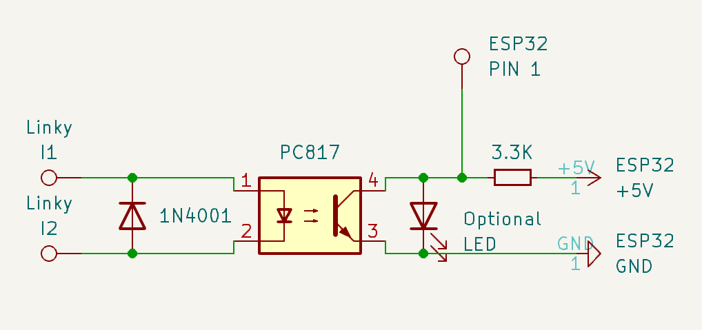

# EDF LinkyReader for TEMPO
EDF Linky reader for Teleinfo data.

It's only relevant to French people but by habits I'll keep the infos in English. Sorry baguette, i'm still one of yours!

## Description
The goal of this code is to read teleinfo data available on the Linky electric counter and display it on the built-in display of a Lilygo T-Display S3.

It's specifically designed for EDF Tempo users as it display:
- Counter for each index (red/white/blue in both hp/hc)
- Instant power consumption with bargraph and min/max

If you have any use of theses data for an external domotic controller like Home Assistant or OpenHAB, support for streaming data to MQTT is available (disabled by default).

## Features
- Remote Debugging enabled (telnet the IP and you have the Serial output)
- Over The Air update enabled (upgrade the firmware over wifi)
- Optional MQTT sender
- Autoreconnect to the WiFi
- Use built-in RTC for time tracking
- Multi thread loop

## Requirements

### Hardware
- 1x Lilygo T-Display S3
- 1x Sharp PC817 optocoupler
- 1x Diode 1N4001
- 1x 3.3K Resistor
- Optional: 1x LED (to see the reading happen)

### Software
- PlatformIO (optional, you can still use the default Arduino IDE but PlatformIO make it much easier as it will auto download the library for you and is preconfigured)

If you choose to go manual, here is the list of library needed:
```
bodmer/TFT_eSPI@^2.5.30
adafruit/RTClib@^2.1.3
arduino-libraries/NTPClient@^3.2.1
karol-brejna-i/RemoteDebug@^4.0.0
knolleary/PubSubClient@^2.8
fbiego/ESP32Time@^2.0.4
```

## Configuration

All configuration are in the file `include/EDF_Teleinfo.h`

### General

|Key||Default value|Description|
|---|:-:|:-:|---|
|`SSID`|Mandatory|`REPLACEME`|Your wifi SSID|
|`PASS`|Mandatory|`REPLACEME`|Your wifi password|
|`IDENTIFIER`|Mandatory|`EDF_Teleinfo`|Used for MQTT ID, OTA and remote debugger|
|`MQTT_ENABLED`|Mandatory|`false`|MQTT feature flag, set to true to enable|
|`TIMER_GRAPH_UPDATE`|Mandatory|`30`|Time in seconds before refreshing the LCD bargraph|

### MQTT specific

|Key||Default value|Description|
|---|:-:|---|---|
|`MQTT_SERVER`||`REPLACEME`|IP of the MQTT server|
|`MQTT_PORT`||`1883`|Port of the MQTT server|
|`TIMER_MQTT_UPDATE`||`10`|Time in seconds between each MQTT message if active|
|`MQTT_TOPIC_BLUE_HC`||`edf/consumption/blue/hc`|MQTT topic to send the counter of watts of blue HC
|`MQTT_TOPIC_WHITE_HC`||`edf/consumption/white/hc`|MQTT topic to send the counter of watts of white HC
|`MQTT_TOPIC_RED_HC`||`edf/consumption/red/hc`|MQTT topic to send the counter of watts of red HC
|`MQTT_TOPIC_BLUE_HP`||`edf/consumption/blue/hp`|MQTT topic to send the counter of watts of blue HP
|`MQTT_TOPIC_WHITE_HP`||`edf/consumption/white/hp`|MQTT topic to send the counter of watts of white HP
|`MQTT_TOPIC_RED_HP`||`edf/consumption/red/hp`|MQTT topic to send the counter of watts of red HP
|`MQTT_TOPIC_PAPP`||`edf/consumption/instant/power`|MQTT topic to send the Instant VA
|`MQTT_TOPIC_POWER`||`edf/consumption/instant/power_watts`|MQTT topic to send the value from Intensity * voltage (239)
|`MQTT_TOPIC_IINST`||`edf/consumption/instant/intensity`|MQTT topic to send the Instant intensity
|`MQTT_TOPIC_IMAX`||`edf/consumption/instant/intensity_max`|MQTT topic to send the Max intensity
|`MQTT_TOPIC_COST_CURRENT`||`edf/consumption/instant/current_cost`|MQTT topic to send the value from cost[power_index] (kWh price)
|`MQTT_TOPIC_COST_POWER`||`edf/consumption/instant/power_cost`|MQTT topic to send the value from power * current_cost

There's other variable but they are not as important, feel free to check the file.

If the pricing change, it's defined on L86, `float cost[6]` (order is `blue_hc, white_hc, red_hc, blue_hp, white_hp, red_hp`)

As of January 13th 2024 (pricing of August 2023)
```
float cost[6] = {0.1056, 0.1246, 0.1328, 0.1369, 0.1654, 0.7324};
```

## Wiring



## Installation

- Clone the repo somewhere
- Open it in Visual Studio Code (with PlatformIO extension). It should pull all dependencies automatically.
- Edit the file `include/EDF_Teleinfo.h` for your variable (wifi ssid/password).
- Upload
- Connect your T-Display S3 to the Linky
- Enjoy

## Update

Just reconnect using USB or use the OTA function. To do so, edit the file `platformio.ini` and add at the bottom:
```
upload_protocol = espota
upload_port = REPLACE_ME_WITH_AN_IP
```

Where `REPLACE_ME_WITH_AN_IP` is the IP of the T-Display S3.

## Debugging

Remote debugging is enabled. From your computer, use `telnet IP` to get the serial output.